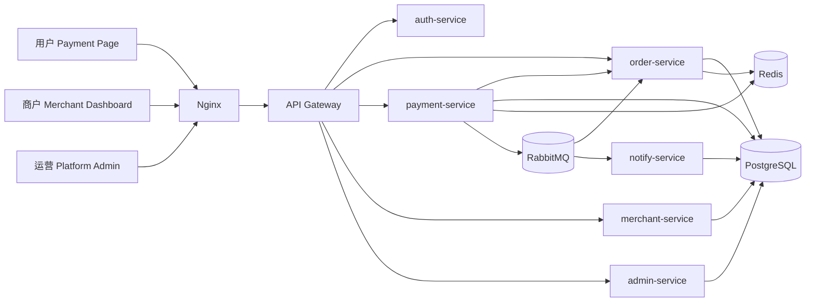
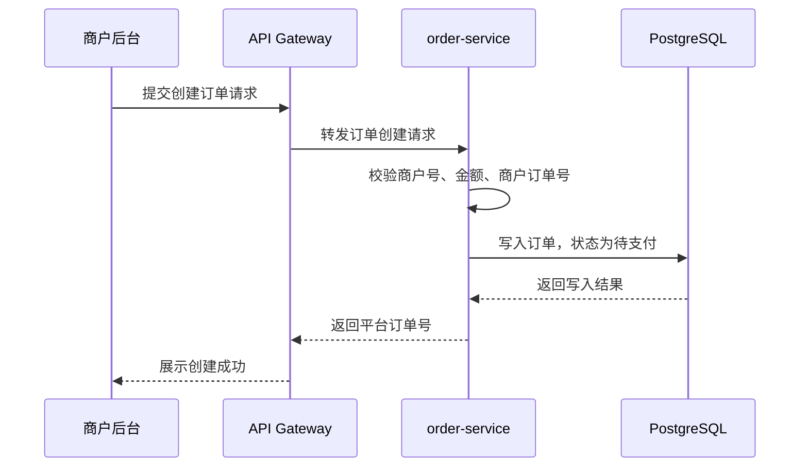
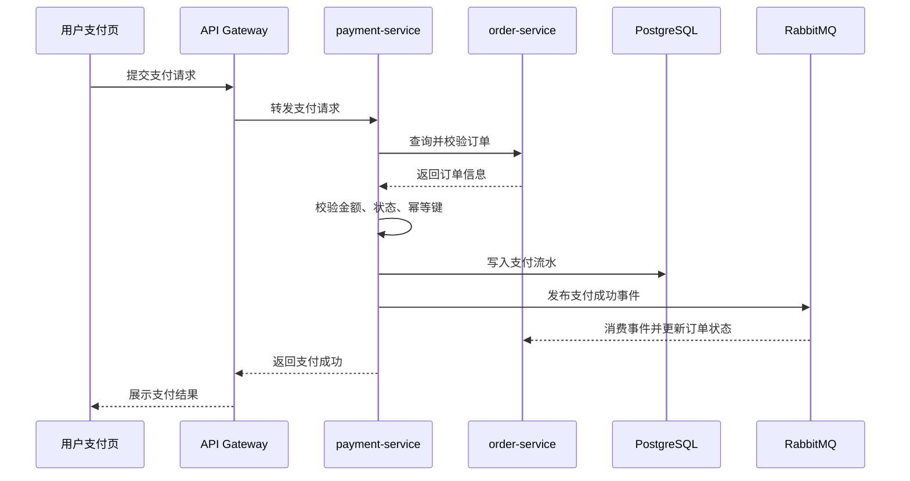
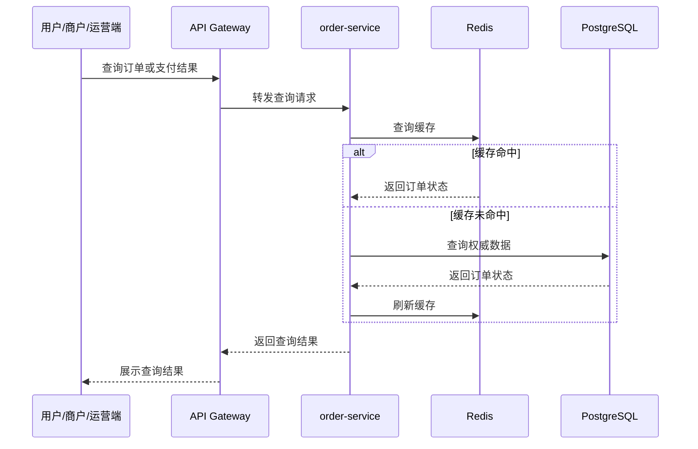

# MiniPay 期末工程完整方案

## 1. 项目概述

MiniPay 是一个面向教学场景的轻量支付平台原型。项目目标不是接入真实银行通道或完成真实资金清结算，而是围绕支付产品中最核心的交易链路，完成一个可运行、可演示、可复核的最小系统。

期末工程需要将前期需求分析、架构设计、技术选型、容器化方案和实验成果整合成一个系统级项目，最终能够完整演示：

```text
商户创建订单 -> 用户发起模拟支付 -> 支付状态更新 -> 结果查询与展示
```

项目应体现从需求、架构、接口、实现、部署、测试到演示答辩的完整工程闭环。

## 2. 建设目标

### 2.1 业务目标

1. 支持商户创建支付订单，并生成唯一平台订单号。
2. 支持用户根据订单号打开支付页面，确认订单信息并发起模拟支付。
3. 支持支付服务完成订单校验、金额校验、状态校验和幂等控制。
4. 支持支付成功后生成支付流水，并更新订单状态。
5. 支持商户、用户和平台运营人员查询订单状态与支付结果。
6. 支持基础后台查询，用于展示运营管理和异常排查能力。

### 2.2 工程目标

1. 使用清晰的服务边界组织系统，避免所有逻辑堆叠在单一接口中。
2. 使用数据库、缓存、消息队列等组件支撑典型支付系统架构。
3. 使用 Docker Compose 实现本地和测试环境的一键启动。
4. 使用 Flyway 管理数据库表结构迁移，保证数据库结构可复现。
5. 提供接口说明、部署说明、测试结果和演示脚本，保证提交内容可复核。

## 3. 系统范围与边界

### 3.1 本期必须完成范围

本期工程优先完成最小可演示系统，核心范围包括：

1. 商户创建订单。
2. 用户发起模拟支付。
3. 支付前订单校验、金额校验、状态校验。
4. 支付幂等控制，避免重复支付生成多笔成功流水。
5. 支付成功后记录支付流水。
6. 订单状态更新。
7. 用户、商户、平台运营端查询订单与支付结果。
8. 前端页面展示完整主链路。
9. Docker Compose 一键启动核心依赖与应用服务。

### 3.2 本期增强实现范围

以下 7 项不再作为可选扩展，本期工程均纳入实现范围，并需要在代码、部署、演示和文档中体现：

1. 登录注册与角色权限控制，由 `auth-service` 或认证模块实现用户、商户、运营人员的身份识别和访问控制。
2. RabbitMQ 支付结果事件，支付成功后通过消息队列驱动订单状态更新、通知记录和后续扩展动作。
3. 商户通知记录和失败重试，由 `notify-service` 记录通知结果，并支持失败重试或补偿任务。
4. Redis 订单状态缓存，用于近期订单状态、支付结果快速查询、幂等 token 和短期锁。
5. 接口限流、统一日志、链路追踪，核心接口需要具备基础限流保护，日志中包含 `traceId`、`orderNo`、`paymentNo` 等排查字段，并能展示跨服务调用链路。
6. GitHub Actions 构建与测试流程，仓库提交后自动执行后端构建、测试、前端构建和基础镜像检查。
7. Prometheus + Grafana 指标监控，采集核心服务健康状态、接口耗时、错误率、订单量、支付成功量等指标，并提供可展示的监控面板。

### 3.3 不纳入本期范围

以下内容不作为期末工程实现目标：

1. 真实银行、微信、支付宝等支付通道接入。
2. 真实资金账户、余额和资金划拨。
3. 跨机构清分清算。
4. 复杂风控审批。
5. 退款仲裁和争议处理。
6. 真实财务对账。
7. 支付牌照、合规认证和跨境结算。

## 4. 用户角色与核心场景

| 角色 | 主要诉求 | 核心操作 |
| --- | --- | --- |
| 用户 | 查看订单信息并完成模拟支付 | 打开支付页、确认金额、提交支付、查看结果 |
| 商户 | 创建订单并跟踪支付状态 | 创建订单、查询订单、查看支付流水 |
| 平台运营人员 | 查询平台交易情况并排查异常 | 查询订单、查询流水、查看商户信息 |
| 系统服务 | 在服务间传递订单、支付和通知事件 | 订单校验、状态更新、缓存刷新、消息投递 |

## 5. 总体架构设计

### 5.1 架构形态

项目采用轻量微服务架构。订单、支付、商户、后台查询和通知的职责不同，拆分服务后可以让状态归属更清晰，也便于期末答辩中解释系统设计。

本期工程在保证核心链路稳定运行的基础上，明确实现认证权限、Redis 缓存、RabbitMQ 事件、商户通知、接口限流、统一日志、链路追踪、CI 和 Prometheus + Grafana 监控。Nacos、Kubernetes、MinIO 等能力仍作为后续演进方向。

### 5.2 系统架构图



### 5.3 服务职责

| 服务/模块 | 核心职责 | 是否必须 |
| --- | --- | --- |
| frontend | 支付页、商户后台、运营后台页面 | 是 |
| nginx | 前端静态资源托管，反向代理 `/api` 到网关 | 是 |
| gateway-service | 统一 API 入口、路由、统一错误返回、鉴权扩展 | 是 |
| order-service | 订单创建、订单状态机、订单查询、缓存刷新 | 是 |
| payment-service | 支付前校验、模拟支付、支付流水、幂等控制 | 是 |
| merchant-service | 商户资料、商户订单视图、商户支付结果查询 | 是 |
| admin-service | 运营后台查询、异常排查、基础统计 | 是 |
| auth-service | 登录注册、Token、角色权限 | 是 |
| notify-service | 商户通知、通知重试和通知记录 | 是 |

## 6. 核心业务流程

### 6.1 创建订单流程



### 6.2 模拟支付流程



本期工程要求接入 RabbitMQ。支付成功后由 `payment-service` 发布支付结果事件，`order-service` 消费事件更新订单状态，`notify-service` 消费事件生成商户通知记录并执行通知或重试。

### 6.3 结果查询流程



## 7. 功能需求设计

| 编号 | 功能 | 说明 | 验收标准 |
| --- | --- | --- | --- |
| FR-01 | 商户创建订单 | 输入商户号、商户订单号、商品描述、金额、回调地址 | 生成唯一平台订单号，状态为待支付 |
| FR-02 | 用户打开支付页 | 根据平台订单号展示订单信息 | 异常订单禁止支付并提示原因 |
| FR-03 | 支付前校验 | 校验订单存在、金额一致、状态可支付 | 校验失败返回统一错误码 |
| FR-04 | 支付幂等 | 防止重复点击或网络重试产生多笔成功支付 | 同一幂等请求返回既有结果或拒绝重复支付 |
| FR-05 | 支付流水 | 支付成功后生成唯一支付流水 | 流水可通过订单号查询 |
| FR-06 | 订单状态更新 | 支付成功后订单从待支付变为已支付 | 查询订单状态与流水结果一致 |
| FR-07 | 商户查询 | 商户查询订单列表、订单详情、支付流水 | 支持订单号、状态、时间范围筛选 |
| FR-08 | 运营查询 | 运营端查询订单、流水、商户和异常记录 | 支持基础排查与统计展示 |
| FR-09 | 商户通知 | 记录商户通知结果并支持失败重试 | 通知失败不影响支付流水落库 |

## 8. 非功能需求设计

| 编号 | 类型 | 要求 |
| --- | --- | --- |
| NFR-01 | 可用性 | 订单创建、支付确认、查询接口应有明确成功或失败返回 |
| NFR-02 | 一致性 | PostgreSQL 作为权威数据源，Redis 只作为缓存 |
| NFR-03 | 幂等性 | 支付接口必须防止重复成功支付 |
| NFR-04 | 可维护性 | 订单、支付、商户、后台服务边界清晰 |
| NFR-05 | 可部署性 | 使用 Docker Compose 启动数据库、缓存、消息队列、网关和应用服务 |
| NFR-06 | 可测试性 | 提供接口测试、核心服务单元测试或联调检查结果 |
| NFR-07 | 可观测性 | 必须提供统一日志、链路追踪和监控指标，日志中记录 traceId、orderNo、paymentNo |

## 9. 技术选型

### 9.1 初始阶段技术栈

| 技术/组件 | 用途 | 选择理由 |
| --- | --- | --- |
| Spring Boot 3 + JDK 21 | 构建后端服务 | 生态成熟，适合 REST 服务快速开发 |
| Spring Cloud Gateway | 统一 API 网关 | 统一路由、错误返回和鉴权入口 |
| Spring Security | 认证和权限控制 | 适合后续区分用户、商户、运营角色 |
| Spring Interface Clients | 服务间同步调用 | 适合支付前订单校验等立即返回场景 |
| MyBatis-Plus | 数据访问层 | 简化 CRUD、分页和条件查询 |
| PostgreSQL 16 | 权威数据存储 | 支持事务、约束、索引、复杂查询 |
| Redis | 缓存和幂等控制 | 支撑订单状态缓存、幂等 token、短期锁 |
| RabbitMQ | 异步事件 | 解耦支付后订单更新和商户通知 |
| Sentinel | 接口限流与熔断降级 | 保护创建订单、发起支付、结果查询等核心接口 |
| SkyWalking | 链路追踪 | 展示 Gateway、订单服务、支付服务、通知服务之间的调用链路 |
| Prometheus + Grafana | 指标采集与监控面板 | 展示服务健康状态、接口耗时、错误率和交易指标 |
| Vue 3 + Vite | 前端页面 | 适合表单、表格和状态展示 |
| Nginx | 前端托管与反向代理 | 区分 Web 入口和业务网关 |
| Docker Compose | 本地和测试环境编排 | 一键启动应用与依赖 |
| Flyway | 数据库迁移 | 保证表结构版本化、可复现 |
| GitHub Actions | CI | 构建、测试和镜像检查 |

### 9.2 后续演进技术

| 技术/组件 | 引入时机 | 作用 |
| --- | --- | --- |
| Nacos | 服务数量增加、多环境配置复杂时 | 服务注册发现、配置中心 |
| Loki | 日志量增加时 | 集中日志检索 |
| Kubernetes | 多实例和滚动发布需求出现时 | 生产级容器编排 |
| MinIO | 出现报表、凭证、文件存储时 | 对象存储 |

## 10. 数据库设计

### 10.1 核心表

#### merchant

| 字段 | 类型 | 说明 |
| --- | --- | --- |
| id | bigint | 主键 |
| merchant_no | varchar(64) | 商户号，唯一 |
| merchant_name | varchar(128) | 商户名称 |
| status | varchar(32) | 商户状态 |
| callback_url | varchar(255) | 默认回调地址 |
| created_at | timestamp | 创建时间 |
| updated_at | timestamp | 更新时间 |

#### pay_order

| 字段 | 类型 | 说明 |
| --- | --- | --- |
| id | bigint | 主键 |
| order_no | varchar(64) | 平台订单号，唯一 |
| merchant_no | varchar(64) | 商户号 |
| merchant_order_no | varchar(64) | 商户订单号 |
| subject | varchar(255) | 商品描述 |
| amount | decimal(18,2) | 订单金额 |
| status | varchar(32) | 订单状态 |
| callback_url | varchar(255) | 商户回调地址 |
| expire_at | timestamp | 过期时间 |
| paid_at | timestamp | 支付完成时间 |
| created_at | timestamp | 创建时间 |
| updated_at | timestamp | 更新时间 |

建议唯一约束：

```sql
unique (merchant_no, merchant_order_no)
unique (order_no)
```

#### payment_record

| 字段 | 类型 | 说明 |
| --- | --- | --- |
| id | bigint | 主键 |
| payment_no | varchar(64) | 支付流水号，唯一 |
| order_no | varchar(64) | 平台订单号 |
| merchant_no | varchar(64) | 商户号 |
| amount | decimal(18,2) | 支付金额 |
| status | varchar(32) | 支付状态 |
| idempotency_key | varchar(128) | 幂等键 |
| paid_at | timestamp | 支付时间 |
| created_at | timestamp | 创建时间 |

建议唯一约束：

```sql
unique (payment_no)
unique (order_no, idempotency_key)
```

#### payment_event

| 字段 | 类型 | 说明 |
| --- | --- | --- |
| id | bigint | 主键 |
| event_id | varchar(64) | 事件编号，唯一 |
| event_type | varchar(64) | 事件类型 |
| aggregate_no | varchar(64) | 关联订单号或流水号 |
| payload | jsonb | 事件内容 |
| status | varchar(32) | 事件状态 |
| retry_count | int | 重试次数 |
| created_at | timestamp | 创建时间 |
| updated_at | timestamp | 更新时间 |

#### notify_record

| 字段 | 类型 | 说明 |
| --- | --- | --- |
| id | bigint | 主键 |
| notify_no | varchar(64) | 通知编号 |
| merchant_no | varchar(64) | 商户号 |
| order_no | varchar(64) | 平台订单号 |
| callback_url | varchar(255) | 回调地址 |
| status | varchar(32) | 通知状态 |
| response_body | text | 商户返回内容 |
| retry_count | int | 重试次数 |
| next_retry_at | timestamp | 下次重试时间 |
| created_at | timestamp | 创建时间 |
| updated_at | timestamp | 更新时间 |

### 10.2 状态设计

#### 订单状态

| 状态 | 说明 |
| --- | --- |
| PENDING | 待支付 |
| PAYING | 支付处理中 |
| PAID | 已支付 |
| CLOSED | 已关闭 |
| EXPIRED | 已过期 |

#### 支付状态

| 状态 | 说明 |
| --- | --- |
| PROCESSING | 处理中 |
| SUCCESS | 支付成功 |
| FAILED | 支付失败 |

#### 通知状态

| 状态 | 说明 |
| --- | --- |
| PENDING | 待通知 |
| SUCCESS | 通知成功 |
| FAILED | 通知失败 |
| RETRYING | 等待重试 |

## 11. 接口设计

统一 API 前缀建议为 `/api`，由 Nginx 转发到 Gateway，再由 Gateway 路由到内部服务。

### 11.1 商户订单接口

#### 创建订单

```http
POST /api/merchant/orders
Content-Type: application/json
```

请求示例：

```json
{
  "merchantNo": "M10001",
  "merchantOrderNo": "MO202606190001",
  "subject": "测试商品",
  "amount": 99.90,
  "callbackUrl": "https://merchant.example.com/pay/callback"
}
```

响应示例：

```json
{
  "code": "SUCCESS",
  "message": "ok",
  "data": {
    "orderNo": "P2026061900010001",
    "status": "PENDING",
    "amount": 99.90,
    "payUrl": "/pay/P2026061900010001"
  }
}
```

#### 查询商户订单列表

```http
GET /api/merchant/orders?merchantNo=M10001&status=PAID&page=1&pageSize=10
```

### 11.2 支付页接口

#### 查询支付页订单信息

```http
GET /api/pay/orders/{orderNo}
```

响应示例：

```json
{
  "code": "SUCCESS",
  "message": "ok",
  "data": {
    "orderNo": "P2026061900010001",
    "subject": "测试商品",
    "amount": 99.90,
    "status": "PENDING",
    "payable": true
  }
}
```

#### 发起模拟支付

```http
POST /api/pay/orders/{orderNo}/confirm
Content-Type: application/json
Idempotency-Key: idem-202606190001
```

请求示例：

```json
{
  "amount": 99.90,
  "payMethod": "MOCK_BALANCE"
}
```

响应示例：

```json
{
  "code": "SUCCESS",
  "message": "payment success",
  "data": {
    "orderNo": "P2026061900010001",
    "paymentNo": "PAY2026061900010001",
    "orderStatus": "PAID",
    "paymentStatus": "SUCCESS"
  }
}
```

### 11.3 订单查询接口

```http
GET /api/orders/{orderNo}
```

响应示例：

```json
{
  "code": "SUCCESS",
  "message": "ok",
  "data": {
    "orderNo": "P2026061900010001",
    "merchantNo": "M10001",
    "merchantOrderNo": "MO202606190001",
    "subject": "测试商品",
    "amount": 99.90,
    "status": "PAID",
    "paymentNo": "PAY2026061900010001",
    "paidAt": "2026-06-19T10:30:00"
  }
}
```

### 11.4 运营后台接口

```http
GET /api/admin/orders?orderNo=P2026061900010001
GET /api/admin/payments?merchantNo=M10001
GET /api/admin/merchants
GET /api/admin/events?orderNo=P2026061900010001
```

### 11.5 统一错误响应

```json
{
  "code": "ORDER_NOT_FOUND",
  "message": "订单不存在",
  "data": null
}
```

建议错误码：

| 错误码 | 说明 |
| --- | --- |
| ORDER_NOT_FOUND | 订单不存在 |
| ORDER_NOT_PAYABLE | 订单不可支付 |
| AMOUNT_MISMATCH | 支付金额不一致 |
| DUPLICATE_PAYMENT | 重复支付 |
| MERCHANT_NOT_FOUND | 商户不存在 |
| VALIDATION_ERROR | 请求参数错误 |
| INTERNAL_ERROR | 系统内部错误 |

## 12. 前端页面设计

### 12.1 支付页

页面路径建议：

```text
/pay/:orderNo
```

核心内容：

1. 商品描述。
2. 订单金额。
3. 订单状态。
4. 支付按钮。
5. 支付结果展示。
6. 异常提示，例如订单不存在、订单已支付、订单过期。

### 12.2 商户后台

页面建议：

1. 创建订单页面。
2. 订单列表页面。
3. 订单详情页面。
4. 支付流水查询页面。

### 12.3 运营后台

页面建议：

1. 平台订单查询。
2. 支付流水查询。
3. 商户信息列表。
4. 事件和通知记录查询。
5. 基础统计卡片，例如今日订单数、支付成功数、支付金额。

## 13. 容器化部署方案

### 13.1 容器拓扑

```text
minipay-network
├── nginx
├── gateway-service
├── auth-service
├── order-service
├── payment-service
├── merchant-service
├── admin-service
├── notify-service
├── postgresql
├── redis
├── rabbitmq
├── flyway
├── sentinel-dashboard
├── skywalking-oap
├── skywalking-ui
├── prometheus
└── grafana
```

### 13.2 镜像构建

后端服务使用多阶段构建：

1. 第一阶段使用 Maven + JDK 21 编译项目。
2. 第二阶段使用 JRE 21 运行服务 jar。

前端使用多阶段构建：

1. 第一阶段使用 Node 构建 Vue 静态资源。
2. 第二阶段使用 Nginx 托管 `dist` 目录。

运行参数通过环境变量和 `.env` 注入，数据库密码、MQ 地址、商户密钥不能写死在镜像中。

### 13.3 Docker Compose 服务

`docker-compose.yml` 必须包含以下服务，保证核心链路和 7 项增强范围都能在本地或测试环境中启动：

1. `postgresql`
2. `redis`
3. `rabbitmq`
4. `flyway`
5. `gateway-service`
6. `auth-service`
7. `order-service`
8. `payment-service`
9. `merchant-service`
10. `admin-service`
11. `notify-service`
12. `nginx`
13. `sentinel-dashboard`
14. `skywalking-oap`
15. `skywalking-ui`
16. `prometheus`
17. `grafana`

### 13.4 配置管理

| 事项 | 方案 |
| --- | --- |
| 数据库初始化 | 使用 Flyway 版本化 SQL |
| 本地开发空库 | 可提供 `init-dev.sql` |
| 配置注入 | 使用环境变量和 `.env` |
| 敏感信息 | 不提交真实密码和密钥 |
| 服务地址 | Compose 阶段使用服务名，不使用 localhost |

### 13.5 推荐启动命令

```bash
docker compose up -d postgresql redis rabbitmq
docker compose run --rm flyway migrate
docker compose up -d --build
```

也可以封装为：

```bash
docker compose up -d --build
```

但要确保 Flyway 迁移在应用服务连接数据库之前完成。

## 14. 质量保证方案

### 14.1 测试范围

| 类型 | 内容 |
| --- | --- |
| 单元测试 | 金额校验、订单状态流转、幂等逻辑 |
| 接口测试 | 创建订单、查询订单、支付确认、重复支付 |
| 集成测试 | 网关到订单服务、支付服务到订单服务、支付后状态更新 |
| 容器启动检查 | Docker Compose 启动后服务健康检查 |
| 前端联调测试 | 支付页、商户后台、运营后台核心流程 |

### 14.2 核心测试用例

| 编号 | 用例 | 预期结果 |
| --- | --- | --- |
| TC-01 | 商户创建合法订单 | 返回平台订单号，状态为 PENDING |
| TC-02 | 查询新建订单 | 返回订单详情，状态为 PENDING |
| TC-03 | 对待支付订单发起支付 | 返回支付成功，生成支付流水 |
| TC-04 | 支付后查询订单 | 订单状态为 PAID，流水状态为 SUCCESS |
| TC-05 | 重复提交同一幂等键 | 返回已有支付结果，不新增成功流水 |
| TC-06 | 已支付订单再次支付 | 返回重复支付或订单不可支付 |
| TC-07 | 金额不一致 | 返回 AMOUNT_MISMATCH |
| TC-08 | 查询不存在订单 | 返回 ORDER_NOT_FOUND |

### 14.3 日志要求

核心日志应至少包含：

1. `traceId`
2. `orderNo`
3. `paymentNo`
4. `merchantNo`
5. 接口耗时
6. 错误码和异常摘要

日志不能打印真实密码、密钥、Token 等敏感信息。

### 14.4 CI 要求

GitHub Actions 必须至少包含：

1. 后端编译。
2. 后端测试。
3. 前端构建。
4. Docker 镜像构建检查。
5. 基础代码格式检查。

CI 结果需要在项目文档包中截图或链接说明，作为期末工程质量治理的证明材料。

### 14.5 监控与链路追踪要求

本期工程必须提供 Prometheus + Grafana 监控和链路追踪展示能力。

监控指标至少包括：

1. 服务健康状态。
2. HTTP 接口请求次数。
3. HTTP 接口耗时。
4. HTTP 错误率。
5. 创建订单数量。
6. 支付成功数量。
7. 支付成功金额。

链路追踪至少覆盖：

1. 前端请求进入 Gateway。
2. Gateway 转发到订单服务。
3. Gateway 转发到支付服务。
4. 支付服务调用订单服务校验订单。
5. 支付服务发布 RabbitMQ 事件。
6. 订单服务消费事件更新状态。
7. 通知服务消费事件并记录通知结果。

## 15. 实施计划

### 15.1 第一阶段：范围收束与项目骨架

目标：

1. 确认最终演示范围。
2. 建立前后端代码仓库结构。
3. 建立数据库迁移目录。
4. 建立 Docker Compose 基础文件。

交付物：

1. 项目目录结构。
2. 服务启动骨架。
3. 初版数据库迁移脚本。

### 15.2 第二阶段：主链路开发

目标：

1. 完成创建订单接口。
2. 完成支付页订单查询接口。
3. 完成模拟支付接口。
4. 完成订单状态更新。
5. 完成支付流水记录。

交付物：

1. `order-service`
2. `payment-service`
3. 主链路接口联调结果。

### 15.3 第三阶段：前端页面与后台查询

目标：

1. 完成支付页。
2. 完成商户创建订单和订单列表。
3. 完成运营后台查询页面。

交付物：

1. Vue 前端页面。
2. 可演示的完整主链路。

### 15.4 第四阶段：工程化补齐

目标：

1. 接入 Redis 幂等、短期锁和订单状态缓存。
2. 接入 RabbitMQ 支付结果事件。
3. 完成 auth-service 登录注册、Token 和角色权限控制。
4. 完成 notify-service 商户通知记录和失败重试。
5. 接入接口限流、统一日志和链路追踪。
6. 配置 Prometheus + Grafana 监控面板。
7. 配置 GitHub Actions 构建与测试流程。
8. 完成容器化启动。

交付物：

1. `docker-compose.yml`
2. 服务 Dockerfile。
3. 测试结果或检查截图。
4. 启动说明。

### 15.5 第五阶段：文档与答辩准备

目标：

1. 整理需求摘要。
2. 整理架构说明。
3. 整理接口说明。
4. 整理部署说明。
5. 整理测试结果。
6. 准备演示脚本和小组分工说明。

交付物：

1. 项目文档包。
2. 演示视频或现场演示脚本。
3. 成员贡献说明。

## 16. 推荐项目目录结构

```text
minipay/
├── README.md
├── docker-compose.yml
├── .env.example
├── docs/
│   ├── requirements.md
│   ├── architecture.md
│   ├── api.md
│   ├── deployment.md
│   ├── test-report.md
│   └── demo-script.md
├── backend/
│   ├── gateway-service/
│   ├── order-service/
│   ├── payment-service/
│   ├── merchant-service/
│   ├── admin-service/
│   └── common/
├── frontend/
│   ├── package.json
│   ├── src/
│   └── Dockerfile
├── db/
│   └── migration/
│       ├── V1__init_schema.sql
│       ├── V2__create_payment_tables.sql
│       └── V3__create_notify_tables.sql
└── scripts/
    ├── start.sh
    └── smoke-test.sh
```

## 17. 演示方案

### 17.1 演示目标

演示时要证明系统不是零散页面，而是一个完整支付链路：

```text
创建订单 -> 打开支付页 -> 模拟支付 -> 查询订单状态 -> 查看支付流水 -> 后台排查
```

### 17.2 演示步骤

1. 启动系统。
   - 展示 `docker compose ps`。
   - 展示 PostgreSQL、Redis、RabbitMQ、后端服务和 Nginx 均已运行。

2. 商户创建订单。
   - 进入商户后台。
   - 输入商品描述和金额。
   - 提交后获得平台订单号和支付链接。

3. 用户打开支付页。
   - 打开支付链接。
   - 展示订单金额、商品信息和待支付状态。

4. 用户发起模拟支付。
   - 点击支付按钮。
   - 展示支付成功结果。
   - 展示支付流水号。

5. 商户查询结果。
   - 回到商户后台。
   - 查询订单列表。
   - 展示订单状态变为已支付。

6. 运营后台排查。
   - 进入平台后台。
   - 查询订单详情、支付流水、事件或通知记录。

7. 重复支付测试。
   - 对已支付订单再次点击支付。
   - 展示系统拒绝重复支付或返回已有支付结果。

### 17.3 答辩重点

1. 为什么选择轻量微服务而不是单体。
2. 为什么 PostgreSQL 是权威数据源，Redis 只做缓存。
3. 为什么支付前使用同步校验，支付后适合使用消息队列。
4. 如何保证重复点击不会产生多笔成功支付。
5. Docker Compose 如何保证环境可复现。
6. Flyway 如何保证数据库结构可迁移。

## 18. 小组分工模板

| 成员 | 负责模块 | 具体贡献 | 答辩可说明内容 |
| --- | --- | --- | --- |
| 成员 A | 架构与网关 | 设计服务边界、实现 Gateway 路由、整理架构文档 | 架构拆分、网关作用、调用链路 |
| 成员 B | 订单服务 | 实现订单创建、订单查询、状态机、数据库表 | 订单模型、状态流转、数据库设计 |
| 成员 C | 支付服务 | 实现模拟支付、支付流水、幂等控制 | 支付校验、幂等设计、重复支付处理 |
| 成员 D | 前端页面 | 实现支付页、商户后台、运营后台 | 页面流程、接口联调、演示链路 |
| 成员 E | 容器化与测试 | 编写 Dockerfile、Compose、测试和部署说明 | 容器拓扑、启动流程、测试结果 |

## 19. 风险与应对

| 风险 | 表现 | 应对措施 |
| --- | --- | --- |
| 主链路不稳定 | 演示时创建订单或支付失败 | 优先冻结功能范围，先打通最小链路 |
| 重复支付问题 | 重复点击产生多笔成功流水 | 使用幂等键、唯一约束和状态校验 |
| 缓存一致性问题 | 支付后查询仍显示待支付 | 状态变更后删除缓存，缓存未命中回源数据库 |
| RabbitMQ 不可用 | 支付后事件无法投递 | 支付流水先落库，事件失败进入补偿或重试 |
| 容器启动失败 | 服务依赖未就绪 | 增加 healthcheck，明确启动顺序 |
| 文档与实现不一致 | 答辩时无法解释 | 最终以实现为准同步更新架构、接口和部署文档 |
| 增强能力集成复杂 | 认证、消息、通知、监控、链路追踪同时接入导致联调压力上升 | 分阶段接入，先保证主链路，再逐项验证 7 项增强能力 |

## 20. 期末提交清单

必须提交：

1. 可运行系统代码仓库 1 份，包含启动说明。
2. 系统演示视频或现场演示脚本 1 份。
3. 项目文档包 1 份，至少包含：
   - 需求摘要
   - 架构说明
   - 接口说明
   - 部署说明
   - 测试或检查结果
   - CI 执行结果
   - 监控面板与链路追踪截图
4. 组内分工说明与成员贡献说明 1 份。

建议补充：

1. `README.md`
2. `.env.example`
3. `docker-compose.yml`
4. API 调试集合或接口测试脚本
5. 关键页面截图
6. 数据库 ER 图或表结构说明
7. 演示视频链接或脚本

## 21. 最终验收标准

项目最终应满足以下标准：

1. 能通过说明文档启动系统。
2. 能成功创建订单。
3. 能打开支付页并展示订单信息。
4. 能完成一次模拟支付。
5. 支付成功后订单状态能变为已支付。
6. 能查询订单和支付流水。
7. 重复支付不会产生第二笔成功流水。
8. 前端页面、接口、数据库和文档描述一致。
9. Docker Compose 能启动主要服务和依赖。
10. 登录注册与角色权限控制可演示。
11. RabbitMQ 支付结果事件可演示。
12. 商户通知记录和失败重试可演示。
13. Redis 订单状态缓存、幂等 token 或短期锁可说明并可验证。
14. 接口限流、统一日志、链路追踪可展示。
15. GitHub Actions 构建与测试流程有执行记录。
16. Prometheus + Grafana 监控面板可展示。
17. 答辩成员能解释自己负责模块的设计和实现。

## 22. 总结

MiniPay 期末工程的核心是完成一个可演示的教学支付平台，而不是堆叠复杂功能。项目应围绕“订单、支付、状态、查询”四个关键词展开，先保证主链路稳定，再补充缓存、消息队列、容器化、测试和文档等工程化内容。

最终交付物应能够清楚回答三个问题：

1. 这个系统解决了什么业务问题。
2. 系统为什么这样拆分和选型。
3. 如何运行、演示和验证这个系统。

只要主链路完整、服务边界清晰、容器化可运行、文档与实现一致，就能满足期末工程综合考核的主要要求。
